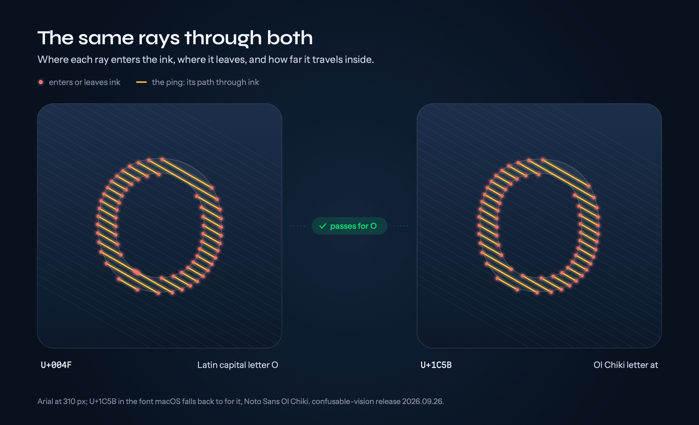
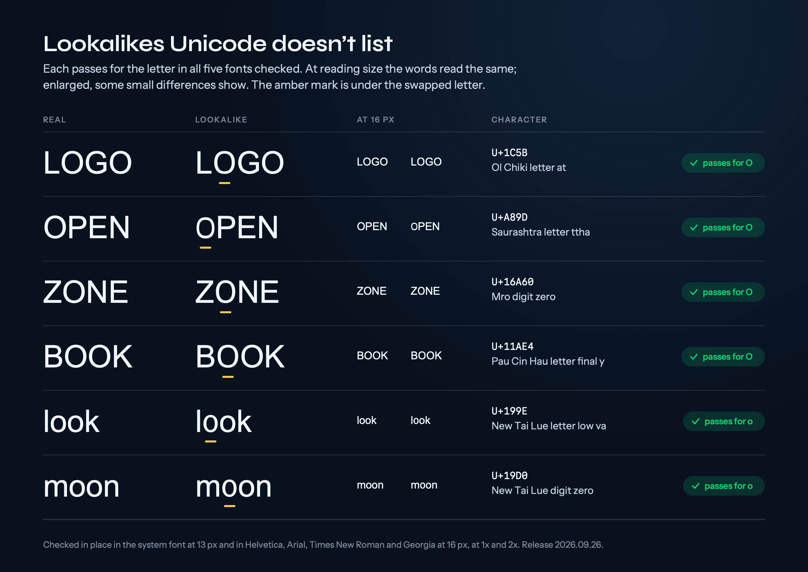

# confusable-vision

**The world's first font-by-font confusables dataset.** Which Unicode characters look like which, measured from the fonts' outlines rather than from pixels. The current release, 2026.09.26, compares every letter and digit that each of 322 fonts draws, at the size and baseline position each glyph has in running text. The lookalikes of ASCII letters and digits are then checked in place: set between other letters in common fonts at the size people read them, and compared with pairs everyone accepts as alike, such as 0 and O.

[addons.mozilla.org](https://addons.mozilla.org/) uses characters from confusable-vision to check add-on names for lookalikes, [credited in Mozilla's source](https://github.com/mozilla/addons-server/blob/master/src/olympia/amo/confusables.py#L4-L6); see [Used by](#used-by).



## Used by

- **Mozilla [addons-server](https://github.com/mozilla/addons-server)**, the code behind [addons.mozilla.org](https://addons.mozilla.org/), adds characters from confusable-vision's output to the table it uses to fold lookalikes to ASCII when checking add-on names: [`src/olympia/amo/confusables.py`](https://github.com/mozilla/addons-server/blob/master/src/olympia/amo/confusables.py), pull requests [#24468](https://github.com/mozilla/addons-server/pull/24468), [#24541](https://github.com/mozilla/addons-server/pull/24541), [#24612](https://github.com/mozilla/addons-server/pull/24612) and [#24665](https://github.com/mozilla/addons-server/pull/24665) (February to March 2026).
- **[disarm](https://disarm.dev/)** ([raeq/disarm](https://github.com/raeq/disarm)), which canonicalises adversarial Unicode before it reaches classifiers, indexes and identifiers, adds measured pairs from confusable-vision to its confusables tables: [`data/confusables_supplement.tsv`](https://github.com/raeq/disarm/blob/main/data/confusables_supplement.tsv), [`data/confusables_vision.tsv`](https://github.com/raeq/disarm/blob/main/data/confusables_vision.tsv).
- **[SilverSpeak](https://acmcmc.github.io/silverspeak/)** ([ACMCMC/silverspeak](https://github.com/ACMCMC/silverspeak)), a Python library for performing and neutralising homoglyph attacks on text, builds the visual neighbours in its homoglyph graph from confusable-vision's discovery files ([`docs/hkb.md`](https://github.com/ACMCMC/silverspeak/blob/main/docs/hkb.md)).
- **[namespace-guard](https://github.com/paultendo/namespace-guard)** ships the measured pairs, and through it they reach [agent-sanitizer](https://github.com/AlexanderMattTurner/agent-sanitizer), which uses namespace-guard as its default engine for folding lookalike characters in an AI agent's tool-call input to ASCII ([deps.dev](https://deps.dev/npm/namespace-guard/0.20.0/dependents)).

These projects took their data from confusable-vision's outputs of February and March 2026.

Discussed on Hacker News: [I rendered 1,418 confusables over 230 fonts](https://news.ycombinator.com/item?id=47150674) and [Confusables.txt and NFKC disagree on 31 characters](https://news.ycombinator.com/item?id=47121716).

Release 2026.09.26 in figures:

- **322 fonts**: every font on macOS, including those it downloads on demand such as PingFang, plus Roboto, Noto Sans, Noto Serif, Noto Sans CJK and DejaVu. **64,751 code points** in 140 scripts.
- **11,517 pairs** alike in at least one font or font combination, of which **5,975** pass the suggested thresholds.
- **719 pairs** of a character and a two-letter ASCII sequence, such as ǁ and ll, or Ы and bl.
- **3,055 candidate lookalikes** of ASCII letters, digits and sequences checked in place: 646 alike at the strict tier, 358 more at the broad tier, 101 more that match another common font's design of the letter. 224 of the strict ones are not in Unicode's confusables.txt.

The data is published as a versioned release in [`data/release/2026.09.26/`](data/release/2026.09.26/DATASET.md) (CC-BY-4.0). [namespace-guard](https://github.com/paultendo/namespace-guard) and [d0ma1n](https://d0ma1n.app) are built on it.

## What changed from release 2

Release 2 (2026.09.24, and 2026.09.25 for the TLD data) compared only the pairs and fonts that earlier runs had compared. An audit of identical glyphs found it caught 637 of the 2,654 cases where a font draws two characters with the same glyph. Release 3 fixes that and adds three things:

- **Coverage.** Every letter and digit each font draws is compared with every other in that font, Han and Hangul included. Release 2 took its characters from a fixed list, so it never reached most of Yi, Canadian Aboriginal, Ethiopic or the Indic scripts, and it missed the script-only fonts and PingFang.
- **The right faces.** Font collections are loaded in the face a browser uses for body text. Earlier runs took the first face, which for some collections was bold, black or italic.
- **Overlapping contours**, as in variable fonts such as San Francisco, are measured as the union of their strokes, as a reader sees them.
- **Two-letter sequences.** Every sequence of two ASCII letters or digits (3,844) is set as each font sets it, with its kerning and ligatures, and compared like a character.
- **The cross-font bar** is set by the upper quartile of the page fonts, so adding fonts to the survey cannot move it.
- **The in-place check** (below).

The March 2026 figures (249,976 single-character pairs and 2,524,275 bigram pairs across 245 fonts) came from measurements that ignored size and baseline. They are superseded; the files from those runs stay in `data/output/` for reference.

## How it works

### Measuring glyphs

RaySpace casts parallel rays through each glyph's outline at 36 angles, 50 rays each, and records five things per ray: how many times it crosses the outline, where, at what angle, how far it travels through ink each time (its ping, the stroke's width along the ray), and the widest gap between strokes. Each glyph is measured twice: in its own box, for shape, and in a fixed frame on the baseline, so size and position count. Two characters are alike in a font when the shape distance is below 0.5 and the baseline-anchored distance below 0.2. The comparison runs in Rust (`native/cv-pairs`), on every core.

- **Within one font**: every pair of letters and digits the font draws.
- **Across fonts**: a character in its own font, as a browser's fallback would draw it, against the 62 ASCII letters and digits of each of 26 page fonts that lack it. It counts when the ASCII letter is the nearest one, and the character is as close to it as that letter is to itself in the upper quartile of the other page fonts.
- **Sequences**: every character against the 3,844 two-character ASCII sequences, as each font sets them (Core Text; HarfBuzz sets them identically apart from the system font's tracking).

### Checking in place

A lookalike measured in isolation can still stand out in a line of text. So every candidate lookalike of an ASCII letter, digit or sequence is set between neighbours (`pa_nel`, `20_5`) in five contexts, the system font at 13 px and Helvetica, Arial, Times New Roman and Georgia at 16 px, each at a device pixel ratio of 1 and 2, with the platform's font fallback. Nothing is rescaled: the lookalike is compared where it lands in the line.

The bar in each context comes from pairs everyone accepts as alike, 0 and O, 1 and l, and I and l, counted only where that context draws them at the same size and position. A lookalike is:

- **strict** when it is as alike as the median of those pairs and passes every check below;
- **broad** when it is as alike as the least alike of them, with one corner allowed to differ and no slant check;
- **design** when it matches the letter as another common font draws it (a J with a bar at the top, in a line whose J has none).

The checks, on both glyphs rasterised at four times the device resolution: the same number of pieces and holes once gaps narrower than a device pixel close; counters square or round alike, in the same place and of about the same size; spacing to the neighbours; the ink's top, bottom and width; right-to-left characters reordering the digits around them; stroke weight; the shape of each side (mirroring); how far the ink reaches into each corner; slant; a stem in the middle (Y against V); and a bar across a stem (Ŧ against T). A two-letter sequence is checked letter by letter.

The tiers were tuned against visual judgements of rendered samples and anchored on the accepted pairs. There has been no study with readers yet.

## What it found

Six of the strict lookalikes that are not in Unicode's confusables.txt, each alike in all five contexts. macOS draws each one with a Noto fallback font:



| Character | Name | Passes for |
|---|---|---|
| ᱛ U+1C5B | OL CHIKI LETTER AT | O |
| ꢝ U+A89D | SAURASHTRA LETTER TTHA | O |
| 𖩠 U+16A60 | MRO DIGIT ZERO | O |
| 𑫤 U+11AE4 | PAU CIN HAU LETTER FINAL Y | O |
| ᦞ U+199E | NEW TAI LUE LETTER LOW VA | o |
| ᧐ U+19D0 | NEW TAI LUE DIGIT ZERO | o |

The ASCII swaps behind most lookalike domains hold only in some fonts. I for l is near identical in the system font, Helvetica and Arial. 1 for l holds only in Times New Roman, 0 for o only in Georgia, whose digits are lowercase height, and rn for m only in Arial at 16 px on a standard-density screen. d for cl and w for vv do not hold at 16 px.

Along the way: Georgia as shipped with macOS and iOS draws ⅳ (U+2173, SMALL ROMAN NUMERAL FOUR) exactly like ⅸ, nine. Windows 11's Georgia is correct. It was first reported on [Microsoft Q&A](https://learn.microsoft.com/en-in/answers/questions/5843826/) in March 2026 and has been reported to Apple.

## The release

| File | One row per |
|---|---|
| `characters.jsonl.gz` | code point measured, with script, category, TR39 identifier type, IDNA2008 status and the TLDs whose registries accept it |
| `lookalikes.jsonl.gz` | pair alike in at least one font or combination, with the counts behind it and the distances in each font |
| `sequences.jsonl.gz` | character alike to a two-character ASCII sequence |
| `in-place.jsonl.gz` | candidate lookalike checked in place, with the verdict and the checks that failed in each context |

[`DATASET.md`](data/release/2026.09.26/DATASET.md) gives every field, what was compared, what an absent pair means and the suggested thresholds. Pin a release by its version. Other committed outputs:

| File | Description |
|---|---|
| `data/output/idn-relevant-pairs.json` | The IDN view of the release: 2,923 pairs that pass its thresholds and whose characters can both be registered at a common TLD. `npx tsx scripts/export-idn-pairs.ts` |
| `data/output/confusable-weights-v4.json`, `font-specific-weights-v4.json` | Weights for namespace-guard: pairs involving an ASCII letter or two scripts, scored by the share of fonts where they are alike (overall, and per font). `scripts/generate-weights-release.ts`, `scripts/generate-font-weights-release.ts` |
| `data/output/unicode-submission/` | Proposed additions to Unicode's confusables data, with the measurements behind each line. `scripts/build-unicode-submission.ts` |
| `data/input/tld-rules.json` | Which characters each delegated TLD's registry accepts at the second level, from IANA's IDN tables, the ICANN registry agreement and researched country-code policies. `scripts/build-tld-rules.py`; d0ma1n imports it |

## Reproducing

Needs macOS (Core Text sets the text), Node 22 or later, Rust, and the Xcode command-line tools for the Swift helpers.

```bash
npm install
(cd native/cv-pairs && cargo build --release)

# Every pair in every font, across fonts, and the sequences (about two hours on an M-series Mac)
npx tsx scripts/score-all.ts --scope all --cross --sequences --out all-pairs-v8

# The in-place check (about 15 minutes), and the ASCII pairs Unicode lists
node --import tsx scripts/in-place.ts --run all-pairs-v8
node --import tsx scripts/in-place.ts --run all-pairs-v8 --pairs data/input/ascii-known.txt --how "Unicode (ASCII)" \
  --out data/output/all-pairs-v8.ascii.in-place.jsonl

# The release, its IDN view, and the weights
npx tsx scripts/build-release.ts 2026.09.26 --run all-pairs-v8
npx tsx scripts/export-idn-pairs.ts
npx tsx scripts/generate-weights-release.ts data/release/2026.09.26
npx tsx scripts/generate-font-weights-release.ts data/release/2026.09.26

# The README's figures
swiftc -O scripts/render-readme-figures.swift -o /tmp/figs && /tmp/figs docs/images
```

## Limits

- The fonts are macOS's, plus Roboto, Noto and DejaVu. Windows fonts are not included.
- The in-place check covers five fonts at 13 and 16 px, at device pixel ratios of 1 and 2.
- Sequences are two characters long.
- The thresholds are measured and anchored on accepted confusables, not tested with readers.

## Related

- [namespace-guard](https://github.com/paultendo/namespace-guard) ships the measured pairs, weights and in-place lookalikes as runtime data.
- [d0ma1n](https://d0ma1n.app) finds the registered lookalikes of a domain using them.
- [REPORT.md](REPORT.md): the technical report from the February 2026 SSIM pipeline.

### Blog posts

Write-ups on [paultendo.github.io](https://paultendo.github.io). The earlier posts describe earlier runs; the figures above supersede theirs.

**RaySpace methodology and findings:**
- [RaySpace: measuring glyph similarity with vector-outline raycasting](https://paultendo.github.io/posts/rayspace-methodology/)
- [From CT scanners to confusable characters: the prior art behind RaySpace](https://paultendo.github.io/posts/rayspace-prior-art/)
- [Multi-character confusables: when rn becomes m](https://paultendo.github.io/posts/multichar-confusables/)
- [250,000 confusable pairs. 102 that matter for domain names.](https://paultendo.github.io/posts/idn-relevance/)

**SSIM pipeline findings:**
- [I rendered 1,418 Unicode confusable pairs across 230 fonts. Most aren't confusable to the eye.](https://paultendo.github.io/posts/confusable-vision-visual-similarity/)
- [793 Unicode characters look like Latin letters but aren't (yet) in confusables.txt](https://paultendo.github.io/posts/confusable-vision-novel-discoveries/)
- [28 CJK and Hangul characters look like Latin letters](https://paultendo.github.io/posts/confusable-vision-cjk-hangul-scan/)
- [248 cross-script confusable pairs that no standard covers](https://paultendo.github.io/posts/confusable-vision-cross-script/)
- [148x faster: rebuilding a Unicode scanning pipeline for cross-script scale](https://paultendo.github.io/posts/confusable-vision-pipeline-148x/)
- [When shape similarity lies: size-ratio artifacts in confusable detection](https://paultendo.github.io/posts/confusable-vision-size-ratio/)
- [The new DDoS: Unicode confusables can't fool LLMs, but they can 5x your API bill](https://paultendo.github.io/posts/confusable-vision-llm-attack-tests/)

### Background

Posts covering the broader problem space that motivated this project:

- [A threat model for Unicode identifier spoofing](https://paultendo.github.io/posts/unicode-identifier-threat-model/)
- [Making Unicode risk measurable](https://paultendo.github.io/posts/making-unicode-risk-measurable/)
- [Your LLM reads Unicode codepoints, not glyphs. That's an attack surface.](https://paultendo.github.io/posts/confusable-llm-attack-vectors/)
- [Who does confusable detection actually protect?](https://paultendo.github.io/posts/anglocentric-confusable-detection/)
- [Unicode ships one confusable map. You need two.](https://paultendo.github.io/posts/confusable-detection-without-nfkc/)
- [confusables.txt and NFKC disagree on 31 characters](https://paultendo.github.io/posts/unicode-confusables-nfkc-conflict/)

## Licence

- **Code** (src/, scripts/, native/, attack-tests/): MIT ([LICENSE](LICENSE))
- **Generated data** (data/output/, data/release/): [CC-BY-4.0](https://creativecommons.org/licenses/by/4.0/) ([LICENSE-DATA](LICENSE-DATA)). Free to use, share, and adapt for any purpose including commercial, with attribution.
- **Unicode data** (the .txt files in data/input/): [Unicode License v3](https://www.unicode.org/license.txt)
- **Attribution**: Paul Wood FRSA (@paultendo), confusable-vision, https://github.com/paultendo/confusable-vision, CC-BY-4.0 (see [NOTICE](NOTICE))
